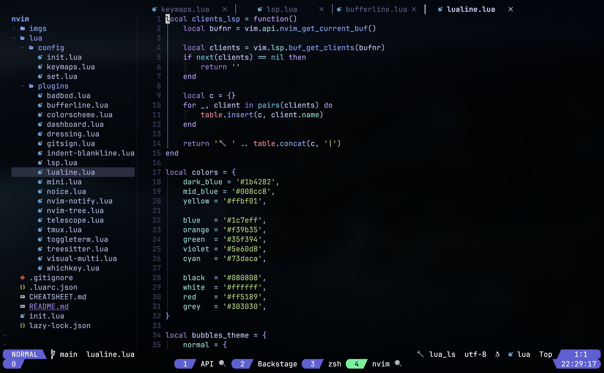

# Hello this is mine custom Nvim

This project was heavily inspired by the [LazyVim](https://www.lazyvim.org/) distribuition, but I decided to create a new project to customize the plugin as I wanted and learn to more about how to configure the stuff on NeoVim



## Roadmap

1. DAG (Debugger Adapter Protocol)

## Installation

1. Do a backup of your current nvim configuration if have one
```
mv ~/.config/nvim{,.bak}
```

2. Next download this distribuition on your nvim directory
```
git clone https://github.com/alaurentinoofficial/nvim ~/.config/nvim
```

3. Start NeoVim and enjoy 😜
```
nvim
```

## [Cheatsheet 💩💩](CHEATSHEET.md)

If your a newer with vim or with this distribution go to the [Cheatsheet 💩💩](CHEATSHEET.md) documentation to learn how to use the keymaps

## Contribution

Just submit a new PR


# Thank you
